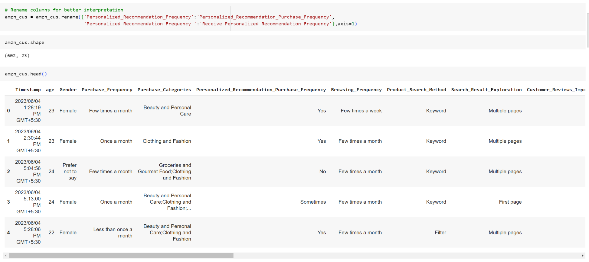
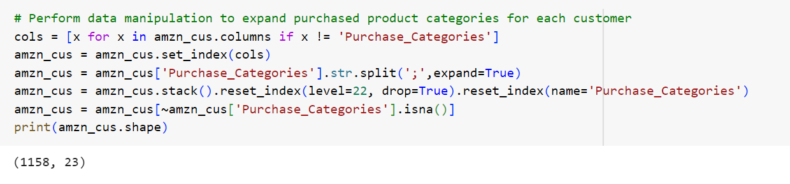
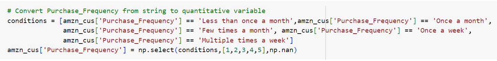
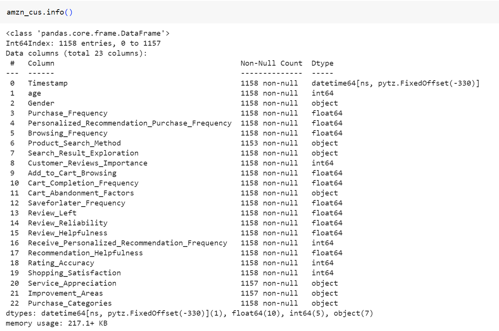

# Exploratory Data Analysis using Tableau: Customer Behaviour in Amazon

Amazon has been one of the world's largest and most influential e-commerce and technology companies, offering a vast range of products through its online platform. Its Prime membership service, offering fast shipping, streaming services, and other benefits, remained popular among consumers, and thus has attracted lots of retail sellers worldwide to join the community. Hence, it would be crucial for merchants to understand customers' behaviour in Amazon, so that they could design better marketing strategy to stand out in such intense competition.

## Data Preprocessing

A dataset has been collected from <a href="https://www.kaggle.com/datasets/swathiunnikrishnan/amazon-consumer-behaviour-dataset">Kaggle</a> from 4th Jun 2023 to 16th Jun 2023. According to the screenshot below, there are 602 data and 23 attributes describing preferences and shopping behaviour in Amazon.

As it is observed that customers have answered multiple product categories that they have bought, we have performed data transformation to split it into separate rows. As a result, there are total of 1158 rows in total.

In addition, ordinal variables (i.e. Purchase_Frequency) have been assigned to integers with Python code example as show below.

Meanwhile, it is found that there are 5 rows having missing values in column "Product_Search_Method" and 1 row having missing value for columns "Service_Appreciation" and "Improvement_Areas". As there are only 6 out of 1158 samples having missing values and there is no specific pattern observed to the missing data, we will ignore the corresponding records in this case.

## Exploratory Data Analysis

### Numerical Features

The analysis is started by studying the correlation among numerical features. In accordance to the correlation matrix as shown below, it is found that there is positive correlation between having helpful information from other customers' reviews and possibility of customers adding products to their cart while browsing on Amazon. Below would be the correlation matrix among numerical variables in Tableau:

Also, it is shown that customers might purchase more frequently in Amazon if they browse Amazon's website or app more often.

### Categorical Features

As depicted in the following charts, the predominant gender among Amazon customers is female, comprising 57.12% of the samples collected.

Also, in the box-plot below, it appears that female customers in Amazon generally is the youngest among all with median of 26 years old, whereas male would be the oldest with median of 31 years old. And age is widely distributed for each gender type especially for those that prefer not to specify gender with standard deviation of 11.

In the grouped bar-chart below, it shows that keyword search has been popular across all genders, which indicates that it would be essential for merchants to input appropriate keyword so as to increase the chance selling their products.

### Dashboard of Visualization in Tableau

Data visualization plays a pivotal role in the realm of data analysis, serving as a cornerstone for effectively conveying information. Presenting data in a comprehensible and visually engaging manner has perennially held great significance. Knowing that Tableau has been a powerful and popular tool in performing data visualization, dashboard is created to visualize customer demographics for each product category that the sellers are interested in with example as shown below.

## Conclusion

Understanding customer demographics is crucial for retailers to have better business planning. Exploratory data analysis using Tableau has provided valuable insights into customer behavior. We have gained a deeper understanding of customer preferences, trends, and patterns as listed below:
- Customers on Amazon are more likely to add products to their cart while browsing when they encounter helpful information in other customers' reviews
- Majority of Amazon customers are female, making up 57.12% of the collected samples with median age of 26.
- Keyword search is widely used by individuals of all genders, highlighting its importance for merchants who aim to boost their product sales.

This analysis has set the foundation for further investigations and model development, including the potential creation of regression or machine learning models to predict customer behaviors more accurately. Overall, the data-driven insights obtained through Tableau will play a crucial role in shaping our strategies and enhancing the customer experience, ultimately leading to improved business outcomes and customer satisfaction.
